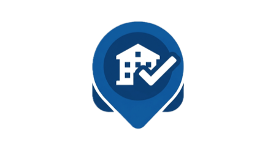
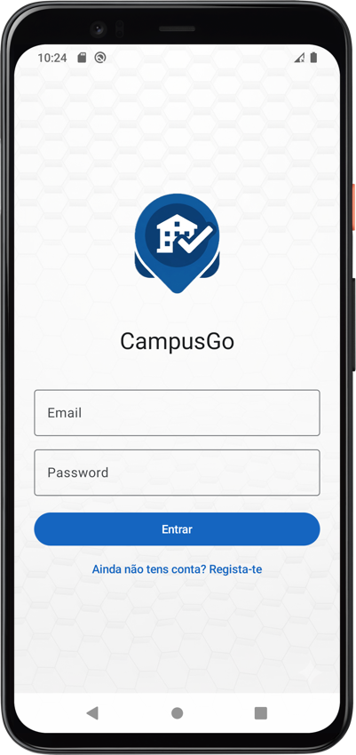
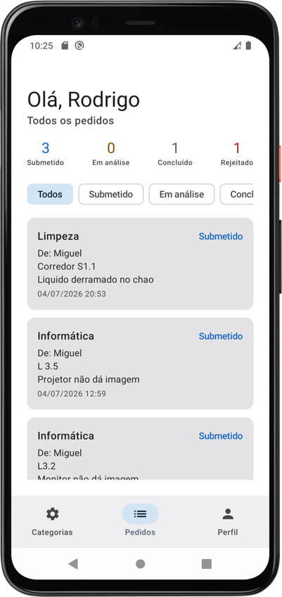

# CampusGo

  

Aplicação Android de gestão de serviços de campus — registo e acompanhamento de pedidos/ocorrências (limpeza, manutenção, segurança, informática), com dois perfis: Utilizador e Administrador.

Trabalho prático individual de Computação Móvel — IPVC.

---

## Tecnologias

- **Kotlin** + **Jetpack Compose** (Material Design 3), Single Activity
- **Arquitetura**: ViewModel + StateFlow, Repository entre a UI e a base de dados
- **Navigation Compose** — grafos de navegação separados por perfil (Utilizador / Administrador)
- **Room** (SQLite local) — sem backend nem servidor remoto
- **Coroutines** para todo o trabalho assíncrono
- Câmara/galeria via `FileProvider` + `ActivityResultContracts`

---

## Requisitos

- Android Studio (versão recente, com suporte a Kotlin 2.2 e Compose)
- JDK 11 ou superior
- Um dispositivo Android físico (recomendado) ou emulador, com **Android 8.0 (API 26)** ou superior
- Ligação à internet não é necessária para usar a app — só para o Android Studio descarregar as dependências na primeira vez

---

## Como executar

1. Abrir a pasta do projeto no Android Studio (`File > Open`)
2. Aguardar que o Gradle sincronize automaticamente as dependências (primeira vez pode demorar alguns minutos)
3. Ligar um dispositivo Android físico via USB (com a depuração USB ativada nas Opções de Programador) ou iniciar um emulador
4. Clicar em **Run ▶** (ou `Shift+F10`)

Não é necessária nenhuma configuração adicional, a aplicação usa apenas uma base de dados local (Room/SQLite), criada automaticamente na primeira execução.

---

## Primeira utilização

Não existem contas pré-criadas. Para testar a aplicação:

1. Abrir a app e escolher **"Ainda não tens conta? Regista-te"**
2. Preencher o formulário de registo, escolhendo o tipo de perfil (**Utilizador** ou **Administrador**)
3. Repetir o registo com o outro tipo de perfil, para testar os dois lados da aplicação

O tipo de perfil fica fixo depois do registo e não pode ser alterado posteriormente.

A app já vem com 4 categorias de exemplo criadas automaticamente (Limpeza, Manutenção, Segurança, Informática), para que seja possível criar pedidos de teste imediatamente após o registo.

---

## Permissões

A aplicação pede permissão de **Câmara** apenas quando o utilizador tenta tirar uma fotografia ao criar um pedido ou ao definir a foto de perfil. A escolha de uma foto da galeria não exige nenhuma permissão especial (usa o seletor de fotos do próprio sistema).

---

## Capturas de ecrã

**Login**

 

  

 

**Todos os pedidos (vista do Administrador)**

 

  

